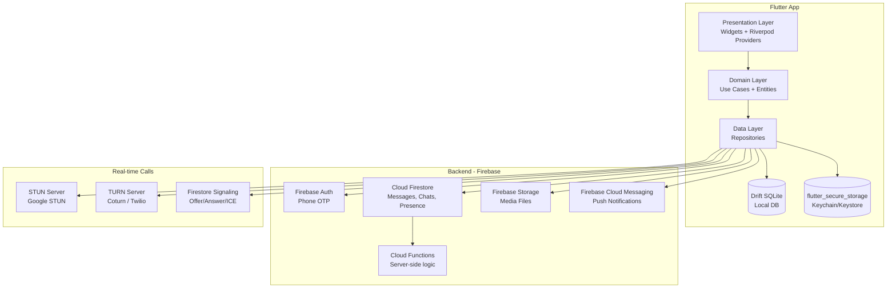
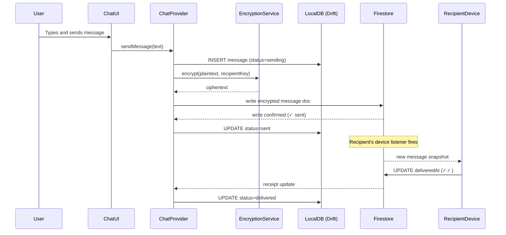
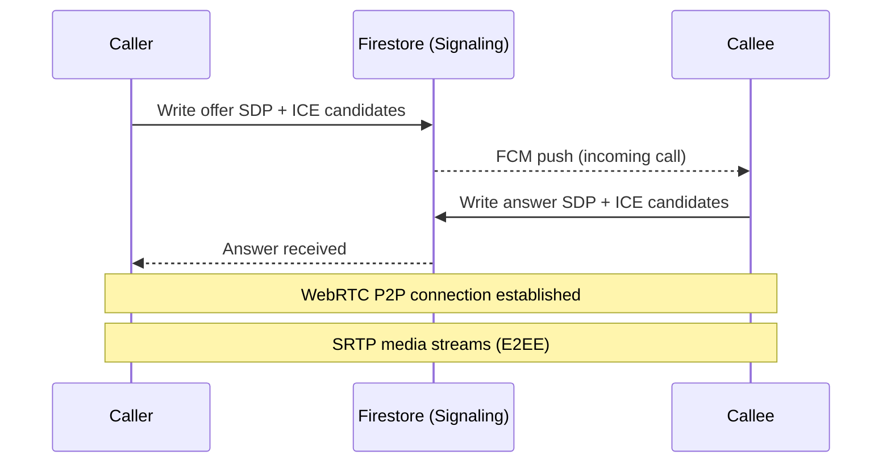

# Design Document: WhatsApp Clone (Flutter)

## Overview

This document describes the technical design for a WhatsApp clone built as a Flutter mobile application targeting Android and iOS. The app replicates the core WhatsApp experience: phone-number-based authentication, real-time one-to-one and group messaging, media sharing, status/stories, voice and video calls, end-to-end encryption, presence indicators, and push notifications.

### Key Design Goals

- **Offline-first**: Messages are stored locally and synced when connectivity is restored.
- **End-to-end encrypted**: All messages and call media are encrypted using the Signal Protocol before leaving the device.
- **Real-time**: Message delivery, presence, and delivery receipts update within seconds using persistent connections.
- **Cross-platform**: A single Flutter codebase targets both Android and iOS with platform-specific adaptations only where necessary (e.g., CallKit on iOS, ConnectionService on Android).

### Technology Summary

| Concern | Choice | Rationale |
|---|---|---|
| State management | Riverpod (flutter_riverpod) | Compile-safe providers, excellent async support, testable |
| Remote database | Firebase Firestore | Real-time listeners, offline persistence, scalable |
| Local database | Drift (SQLite ORM) | Type-safe reactive queries, migrations, offline-first |
| Authentication | Firebase Auth + custom OTP | Phone auth with SMS/voice fallback |
| Push notifications | Firebase Cloud Messaging (FCM) | Cross-platform, background delivery |
| Real-time calls | flutter_webrtc + STUN/TURN | WebRTC P2P with server relay fallback |
| E2EE | libsignal_protocol_dart | Signal Protocol (Double Ratchet + X3DH) |
| Media storage | Firebase Storage | CDN-backed, resumable uploads |
| Navigation | go_router | Declarative, deep-link friendly |
| Secure storage | flutter_secure_storage | Keychain (iOS) / Keystore (Android) |

---

## Architecture

The app follows a **feature-first Clean Architecture** with three layers per feature:

```
Presentation  →  Domain  →  Data
(Widgets/Providers)  (Entities/Use Cases)  (Repositories/Remote/Local)
```

Each of the twelve services defined in the requirements maps to a feature module. Cross-cutting concerns (encryption, secure storage, network) live in a shared `core/` module.

### High-Level Architecture Diagram



### Folder Structure

```
lib/
├── core/
│   ├── encryption/          # Encryption_Service (Signal Protocol)
│   ├── network/             # Connectivity, retry logic
│   ├── storage/             # Secure storage wrapper
│   ├── router/              # go_router configuration
│   └── theme/               # App theme, colors, typography
├── features/
│   ├── auth/                # Requirement 1 – Auth_Service
│   │   ├── data/
│   │   ├── domain/
│   │   └── presentation/
│   ├── contacts/            # Requirement 2 – Contact_Service
│   ├── chats/               # Requirements 3, 4, 5 – Chat_Service
│   ├── media/               # Requirement 6 – Media_Service
│   ├── status/              # Requirement 7 – Status_Service
│   ├── calls/               # Requirement 8 – Call_Service
│   ├── presence/            # Requirement 10 – Presence_Service
│   ├── notifications/       # Requirement 11 – Notification_Service
│   └── profile/             # Requirement 12 – Profile & Privacy
└── main.dart
```

### Data Flow: Sending a Message



---

## Components and Interfaces

### Auth_Service

Handles phone-number registration, OTP verification, and session persistence.

**Key classes:**
- `AuthRepository` – interface between domain and Firebase Auth
- `PhoneVerificationUseCase` – orchestrates OTP send → verify → session create
- `SessionManager` – persists and retrieves the session token via `flutter_secure_storage`

**Interface:**
```dart
abstract class AuthRepository {
  Future<void> sendOtp(String phoneE164);
  Future<Session> verifyOtp(String otp);
  Future<void> logout();
  Stream<Session?> get sessionStream;
}
```

**OTP Flow:**
1. User enters phone number → validated against E.164 regex client-side.
2. `sendOtp()` calls Firebase Auth `verifyPhoneNumber()`.
3. Firebase sends SMS; on timeout (60 s) the UI offers a "Call me instead" button that triggers a voice-call OTP via a Cloud Function.
4. User enters 6-digit code → `verifyOtp()` calls `PhoneAuthCredential.signInWithCredential()`.
5. On success, the Firebase ID token is stored in the device keychain via `flutter_secure_storage`.
6. Three consecutive failures trigger a 1-hour lockout enforced by a Cloud Function rate-limiter and a local countdown timer.

### Contact_Service

Discovers which device contacts are registered users.

**Key classes:**
- `ContactRepository`
- `ContactSyncUseCase` – hashes phone numbers (SHA-256) before upload
- `BlockListRepository`

**Interface:**
```dart
abstract class ContactRepository {
  Future<List<AppContact>> syncContacts(List<String> hashedNumbers);
  Stream<List<AppContact>> watchContacts();
  Future<void> blockUser(String userId);
  Future<void> unblockUser(String userId);
}
```

**Privacy:** Only SHA-256 hashes of phone numbers are sent to the server. The server returns the subset that match registered users. Raw numbers never leave the device.

### Chat_Service

Manages conversations, messages, delivery receipts, and group metadata.

**Key classes:**
- `ConversationRepository`
- `MessageRepository`
- `DeliveryReceiptRepository`
- `GroupRepository`

**Interface:**
```dart
abstract class MessageRepository {
  Future<Message> sendMessage(SendMessageParams params);
  Stream<List<Message>> watchMessages(String conversationId);
  Future<void> deleteMessageForMe(String messageId);
  Future<void> deleteMessageForEveryone(String messageId);
  Future<void> markAsRead(String conversationId);
}

abstract class ConversationRepository {
  Stream<List<Conversation>> watchConversations();
  Future<void> archiveConversation(String id);
  Future<void> deleteConversation(String id);
  Future<List<SearchResult>> search(String query);
}
```

**Delivery Receipt State Machine:**
```
SENDING → SENT (✓) → DELIVERED (✓✓) → READ (blue ✓✓)
```
- `SENT`: Firestore write acknowledged.
- `DELIVERED`: Recipient device writes `deliveredAt` timestamp to the message document.
- `READ`: Recipient opens the conversation; device writes `readAt` timestamp.

### Media_Service

Handles upload, download, compression, and caching of media files.

**Key classes:**
- `MediaRepository`
- `MediaCompressor` – uses `flutter_image_compress` for images, `ffmpeg_kit_flutter` for video
- `MediaCache` – LRU disk cache backed by the app's cache directory

**Interface:**
```dart
abstract class MediaRepository {
  Future<String> uploadMedia(File file, MediaType type);
  Future<File> downloadMedia(String url, String messageId);
  Stream<double> uploadProgress(String uploadId);
  Future<void> retryFailedUpload(String uploadId);
}
```

**Compression rules:**
- Images > 5 MB: compress to JPEG quality 85, max 1920×1080, preserving aspect ratio.
- Videos: pass-through up to 100 MB; no server-side transcoding in v1.
- Voice notes: recorded as AAC at 32 kbps, max 2 minutes (~480 KB).

**Auto-download policy** (configurable in settings):
- Wi-Fi: auto-download images; manual for video/documents.
- Mobile data: manual for all media types.

### Call_Service

Manages WebRTC-based voice and video calls.

**Key classes:**
- `CallRepository`
- `WebRtcCallManager` – wraps `flutter_webrtc`
- `CallSignalingService` – uses Firestore as the signaling channel

**Interface:**
```dart
abstract class CallRepository {
  Future<Call> initiateCall(String recipientId, CallType type);
  Future<void> answerCall(String callId);
  Future<void> endCall(String callId);
  Stream<CallState> watchCallState(String callId);
  Future<void> toggleMute(bool muted);
  Future<void> toggleCamera(bool enabled);
  Future<void> switchCamera();
}
```

**Call Establishment Flow:**


**Group calls:** For calls with ≤ 8 video streams, a mesh topology is used (each peer connects to every other peer). For voice-only calls up to 32 participants, a selective forwarding unit (SFU) approach via a TURN server is used.

### Encryption_Service

Implements the Signal Protocol for E2EE.

**Key classes:**
- `EncryptionService` – top-level facade
- `SignalProtocolStore` – persists identity keys, pre-keys, and session state in Drift
- `KeyManager` – generates and rotates key bundles

**Interface:**
```dart
abstract class EncryptionService {
  Future<void> initialize(String userId);
  Future<Uint8List> encryptMessage(String recipientId, String plaintext);
  Future<String> decryptMessage(String senderId, Uint8List ciphertext);
  Future<KeyBundle> getPublicKeyBundle();
  Future<bool> verifySecurityCode(String contactId, String code);
}
```

**Key storage:** The identity private key is stored exclusively in `flutter_secure_storage` (iOS Keychain / Android Keystore). Pre-keys and session state are stored in the Drift local database (encrypted at rest using SQLCipher).

**Key change notification:** When a user re-registers (new device), the server publishes a new key bundle to Firestore. All contacts with open sessions receive a "Security code changed" system message before the next message is delivered.

### Presence_Service

Tracks and broadcasts online/offline/last-seen state.

**Key classes:**
- `PresenceRepository`
- `PresenceHeartbeatService` – sends periodic heartbeats while app is foregrounded

**Interface:**
```dart
abstract class PresenceRepository {
  Future<void> setOnline();
  Future<void> setOffline();
  Stream<PresenceInfo> watchPresence(String userId);
  Future<void> updatePrivacySetting(PresencePrivacy setting);
}
```

**Implementation:** Firestore's `onDisconnect()` handler sets `lastSeen` when the client disconnects. The app writes `isOnline: true` on foreground and relies on the `onDisconnect` trigger for offline transitions. Privacy settings are enforced server-side via Firestore Security Rules.

### Notification_Service

Delivers push notifications for messages and calls.

**Key classes:**
- `NotificationRepository`
- `FcmHandler` – processes FCM payloads in foreground, background, and terminated states
- `LocalNotificationManager` – uses `flutter_local_notifications` for in-app display

**Interface:**
```dart
abstract class NotificationRepository {
  Future<void> initialize();
  Future<void> muteConversation(String id, MuteDuration duration);
  Future<void> dismissNotification(String conversationId);
  Stream<NotificationAction> get notificationActions;
}
```

**Call notifications:** Incoming calls use FCM high-priority data messages. On Android, a foreground service with `CallStyle` notification is shown. On iOS, CallKit is invoked via a VoIP push (APNs VoIP certificate).

---

## Data Models

### Firestore Collections

```
/users/{userId}
  - phoneNumber: string (E.164)
  - displayName: string
  - photoUrl: string?
  - statusBio: string?
  - publicKeyBundle: map  ← Signal Protocol pre-key bundle
  - privacySettings: map
  - createdAt: timestamp

/conversations/{conversationId}
  - type: "direct" | "group"
  - participantIds: string[]
  - lastMessagePreview: string  ← encrypted, shown only to participants
  - lastMessageAt: timestamp
  - groupName: string?
  - groupIconUrl: string?
  - adminIds: string[]?
  - messagingRestricted: bool?  ← admins-only mode

/conversations/{conversationId}/messages/{messageId}
  - senderId: string
  - ciphertext: bytes          ← encrypted payload
  - mediaUrl: string?          ← encrypted media URL
  - mediaType: string?
  - sentAt: timestamp
  - deliveredAt: timestamp?
  - readAt: timestamp?
  - deletedForEveryone: bool
  - quotedMessageId: string?
  - type: "text" | "image" | "video" | "audio" | "document" | "location" | "system"

/status/{userId}/items/{statusId}
  - mediaUrl: string?
  - text: string?
  - backgroundColor: string?
  - postedAt: timestamp
  - expiresAt: timestamp        ← postedAt + 24h
  - viewers: map<userId, timestamp>
  - privacyList: string[]?

/calls/{callId}
  - callerId: string
  - calleeIds: string[]
  - type: "voice" | "video"
  - state: "ringing" | "active" | "ended" | "missed"
  - startedAt: timestamp?
  - endedAt: timestamp?
  - offer: map?                 ← SDP signaling
  - answer: map?
  - iceCandidates: array

/presence/{userId}
  - isOnline: bool
  - lastSeen: timestamp
  - privacySetting: "everyone" | "contacts" | "nobody"
```

### Local Drift Schema (SQLite)

```dart
// Core tables stored locally for offline-first access

class MessagesTable extends Table {
  TextColumn get id => text()();
  TextColumn get conversationId => text()();
  TextColumn get senderId => text()();
  BlobColumn get ciphertext => blob()();
  TextColumn get plaintextCache => text().nullable()(); // decrypted, in-memory only
  TextColumn get mediaLocalPath => text().nullable()();
  TextColumn get type => text()();
  IntColumn get sentAt => integer()();
  IntColumn get deliveredAt => integer().nullable()();
  IntColumn get readAt => integer().nullable()();
  BoolColumn get deletedForEveryone => boolean().withDefault(const Constant(false))();
  TextColumn get quotedMessageId => text().nullable()();
  TextColumn get status => text()(); // sending | sent | delivered | read | failed
}

class ConversationsTable extends Table {
  TextColumn get id => text()();
  TextColumn get type => text()(); // direct | group
  TextColumn get lastMessagePreview => text().nullable()();
  IntColumn get lastMessageAt => integer().nullable()();
  BoolColumn get isArchived => boolean().withDefault(const Constant(false))();
  IntColumn get unreadCount => integer().withDefault(const Constant(0))();
  IntColumn get mutedUntil => integer().nullable()();
}

class SignalSessionsTable extends Table {
  TextColumn get recipientId => text()();
  TextColumn get deviceId => text()();
  BlobColumn get sessionRecord => blob()(); // serialized Signal session
}

class PreKeysTable extends Table {
  IntColumn get keyId => integer()();
  BlobColumn get keyRecord => blob()();
  BoolColumn get used => boolean().withDefault(const Constant(false))();
}
```

### Domain Entities

```dart
class Message {
  final String id;
  final String conversationId;
  final String senderId;
  final String? plaintext;        // null until decrypted
  final String? mediaUrl;
  final MediaType? mediaType;
  final MessageType type;
  final DateTime sentAt;
  final DateTime? deliveredAt;
  final DateTime? readAt;
  final DeliveryStatus status;
  final bool deletedForEveryone;
  final String? quotedMessageId;
}

class Conversation {
  final String id;
  final ConversationType type;
  final List<String> participantIds;
  final String? lastMessagePreview;
  final DateTime? lastMessageAt;
  final int unreadCount;
  final bool isArchived;
  final DateTime? mutedUntil;
  // Group-specific
  final String? groupName;
  final String? groupIconUrl;
  final List<String>? adminIds;
  final bool messagingRestricted;
}

class AppContact {
  final String userId;
  final String phoneNumber;
  final String displayName;
  final String? photoUrl;
  final bool isBlocked;
}

class PresenceInfo {
  final String userId;
  final bool isOnline;
  final DateTime? lastSeen;
}

class Call {
  final String id;
  final String callerId;
  final List<String> calleeIds;
  final CallType type;
  final CallState state;
  final DateTime? startedAt;
  final DateTime? endedAt;
}
```

---

## Correctness Properties

*A property is a characteristic or behavior that should hold true across all valid executions of a system — essentially, a formal statement about what the system should do. Properties serve as the bridge between human-readable specifications and machine-verifiable correctness guarantees.*

### Property 1: OTP lockout after repeated failures

*For any* sequence of three consecutive incorrect OTP submissions, the Auth_Service SHALL lock further verification attempts and the lockout duration SHALL be exactly 1 hour.

**Validates: Requirements 1.5**

### Property 2: Message encryption round-trip

*For any* plaintext message and any valid recipient key bundle, encrypting the message and then decrypting it with the corresponding private key SHALL produce the original plaintext.

**Validates: Requirements 9.1, 9.6**

### Property 3: Delivery receipt monotonicity

*For any* message, the delivery status SHALL only advance forward through the state machine (SENDING → SENT → DELIVERED → READ) and SHALL never regress to a prior state.

**Validates: Requirements 4.3, 4.4, 4.5**

### Property 4: Status expiry

*For any* status item, it SHALL NOT be visible to any viewer after exactly 24 hours have elapsed since its `postedAt` timestamp.

**Validates: Requirements 7.1, 7.5**

### Property 5: Whitespace-only display names are invalid

*For any* string composed entirely of whitespace characters, the Auth_Service SHALL reject it as a display name and the user profile SHALL remain unchanged.

**Validates: Requirements 1.7, 12.1**

### Property 6: Contact hash privacy

*For any* set of phone numbers uploaded during contact sync, the payload sent to the server SHALL contain only SHA-256 hashes and SHALL NOT contain any raw phone number strings.

**Validates: Requirements 2.1**

### Property 7: Blocked user message rejection

*For any* user A who has blocked user B, any message sent by B to A SHALL be rejected and SHALL NOT appear in A's conversation.

**Validates: Requirements 2.5**

### Property 8: Group participant list consistency

*For any* group, after an admin adds or removes a participant, the participant list observed by all remaining members SHALL reflect the change within 2 seconds.

**Validates: Requirements 5.3**

### Property 9: Media compression size invariant

*For any* image file larger than 5 MB, after compression the resulting file SHALL be strictly less than or equal to 5 MB and the aspect ratio SHALL be preserved (width/height ratio within 0.01 of the original).

**Validates: Requirements 6.1**

### Property 10: Upload retry exhaustion

*For any* media upload that fails, the Media_Service SHALL retry exactly 3 times with exponential back-off before surfacing an error to the user, and SHALL NOT retry more than 3 times.

**Validates: Requirements 6.8**

### Property 11: Privacy setting enforcement for last-seen

*For any* user with last-seen privacy set to "Nobody", no other user's device SHALL receive that user's last-seen timestamp via the Presence_Service.

**Validates: Requirements 10.4**

### Property 12: Delete-for-everyone within window

*For any* message deleted for everyone within 60 minutes of sending, all participants in the conversation SHALL see "This message was deleted" in place of the original content.

**Validates: Requirements 4.9**

### Property 13: Status viewer list completeness

*For any* status item, the set of users recorded as having viewed it SHALL be a subset of the status owner's contacts (or privacy list), and every contact who viewed it SHALL appear in the viewer list.

**Validates: Requirements 7.3, 7.4**

---

## Error Handling

### Network Errors

- All repository calls wrap network operations in a `Result<T, AppError>` type (using the `fpdart` package or a simple sealed class).
- Transient failures (HTTP 5xx, socket timeout) trigger automatic retry with exponential back-off (initial delay 1 s, max 3 retries, max delay 30 s).
- Persistent failures surface a user-visible error snackbar with a "Retry" action.
- Outgoing messages that fail to reach Firestore are persisted locally with `status=failed` and retried automatically when connectivity is restored (monitored via `connectivity_plus`).

### Offline Handling

- The Drift local database is the primary read source; Firestore is the sync target.
- When offline, the app reads from Drift and queues writes. On reconnect, the queue is flushed in order.
- Firestore's built-in offline persistence (`FirebaseFirestore.instance.settings = Settings(persistenceEnabled: true)`) provides an additional layer for Firestore-backed reads.

### Encryption Errors

- If decryption fails (e.g., session state mismatch after reinstall), the message is displayed as "Unable to decrypt this message" with a prompt to verify the security code.
- Key bundle fetch failures prevent message sending and surface a clear error rather than sending unencrypted.

### Media Errors

- Upload failures: retry up to 3 times with exponential back-off (1 s, 2 s, 4 s). After exhaustion, show "Upload failed. Tap to retry."
- Download failures: same retry policy. Thumbnail is shown while the full file is unavailable.
- Compression failures: fall back to sending the original file if it is within the size limit; otherwise show "File too large."

### Call Errors

- ICE negotiation failure: attempt TURN relay fallback automatically.
- Poor network quality (packet loss > 10% or RTT > 400 ms): display "Poor connection" indicator (Requirement 8.9).
- Unanswered call after 30 s: end the call attempt and write a missed-call system message.

### Authentication Errors

- Invalid phone number format: validated client-side before any network call.
- OTP timeout: prompt user to request a new OTP.
- Account locked: display countdown timer; disable all OTP input fields.

---

## Testing Strategy

### Unit Tests

Unit tests cover pure business logic in the domain layer and utility functions:

- `PhoneNumberValidator` – valid/invalid E.164 formats
- `MessageStatusMachine` – state transition logic
- `MediaCompressor` – compression output size and aspect ratio
- `OtpLockoutTimer` – countdown and reset logic
- `ContactHasher` – SHA-256 hashing correctness
- `PresencePrivacyFilter` – filtering logic for "Nobody" / "My Contacts" / "Everyone"

### Property-Based Tests

Property-based testing is applied to the core logic components where universal properties hold across a wide input space. The chosen library is [**dart_test** with **fast_check**](https://pub.dev/packages/fast_check) (a Dart port of fast-check), configured to run a minimum of 100 iterations per property.

Each property test is tagged with a comment referencing the design property:
```dart
// Feature: whatsapp-clone, Property 2: Message encryption round-trip
```

**Properties to implement as PBT:**

| Property | Component | Generator |
|---|---|---|
| P2: Encryption round-trip | `EncryptionService` | Random plaintext strings (unicode, emoji, long strings) |
| P3: Delivery receipt monotonicity | `MessageStatusMachine` | Random sequences of status update events |
| P4: Status expiry | `StatusExpiryChecker` | Random `postedAt` timestamps and query times |
| P5: Whitespace display name rejection | `DisplayNameValidator` | Strings of whitespace characters (space, tab, newline, NBSP) |
| P6: Contact hash privacy | `ContactHasher` | Random phone number lists |
| P9: Media compression size invariant | `MediaCompressor` | Random image sizes > 5 MB |
| P10: Upload retry exhaustion | `MediaUploadManager` | Simulated failure sequences |
| P12: Delete-for-everyone content replacement | `MessageRepository` (mock) | Random message content and deletion timing within window |

### Integration Tests

Integration tests verify the wiring between components and Firebase services. These use a Firebase Emulator Suite (Auth, Firestore, Storage, Functions) running locally:

- Full OTP registration flow (Auth emulator)
- Message send → delivery receipt update cycle (Firestore emulator)
- Contact sync with hashed numbers (Functions emulator)
- Media upload → download round-trip (Storage emulator)
- Group creation and participant management
- Status post → expiry via Cloud Function

### Widget Tests

Widget tests cover the presentation layer using `flutter_test` and `mocktail` for mocking providers:

- `ChatListScreen` – renders conversations sorted by timestamp, shows unread badges
- `MessageBubble` – renders delivery receipt icons correctly per status
- `CallScreen` – shows mute/camera controls, poor-connection indicator
- `StatusViewer` – 24-hour expiry display, viewer list

### End-to-End Tests

E2E tests use `integration_test` package against the Firebase Emulator Suite:

- Register two users, exchange a message, verify delivery receipts
- Post a status, verify it appears for a contact, verify expiry after simulated 24 h
- Initiate a call, verify signaling documents in Firestore, verify missed-call message

### Performance Tests

- Search 10,000 messages by keyword: must return results within 500 ms (Requirement 3.6). Tested with a pre-populated Drift database.
- Message delivery latency: measured end-to-end in the emulator environment, target < 2 s (Requirement 4.1).
